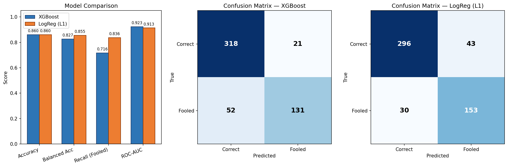
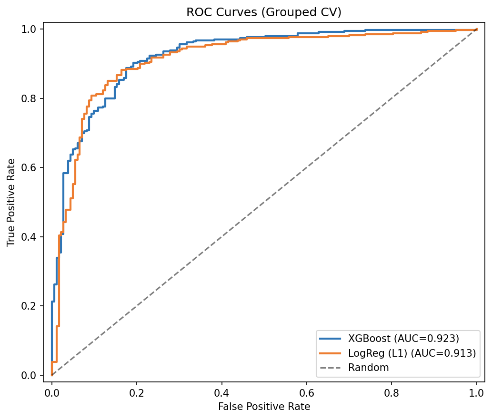
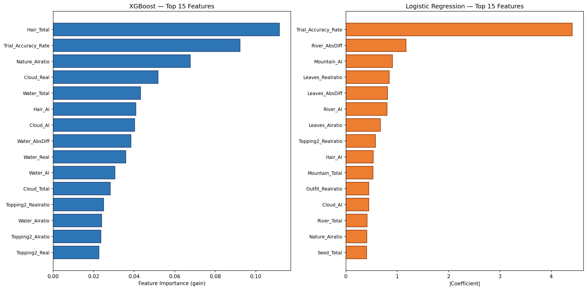
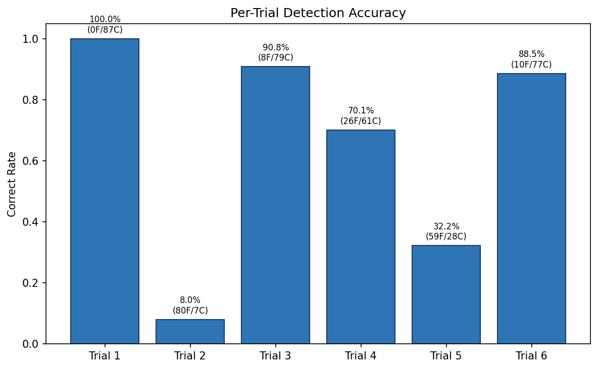
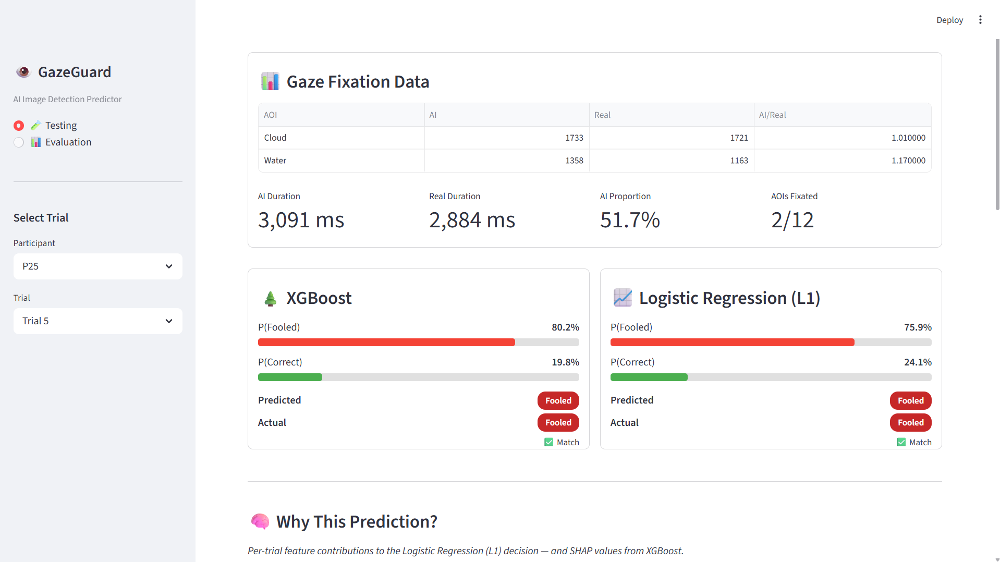
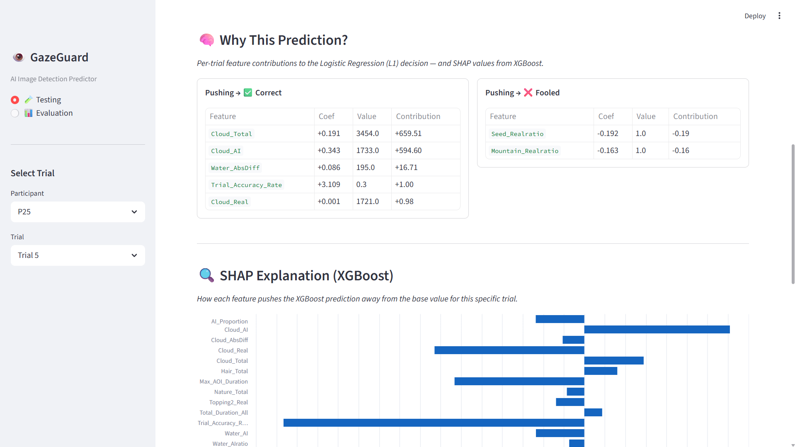
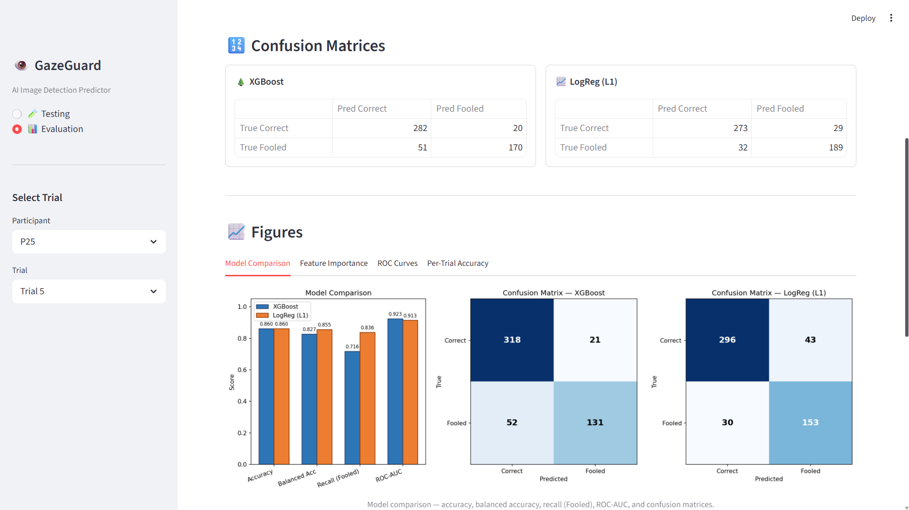

# GazeGuard — Predicting Human AI-Image Detection from Eye-Gaze Patterns

**WID2003 Cognitive Science | Group Project: Eye Wonder**

## Overview

GazeGuard is a machine-learning system that predicts whether a person will correctly identify an AI-generated image — or be fooled by it — using only their eye-tracking data.

Most deepfake detectors analyze the **image itself**. GazeGuard flips this: it learns the **eye-movement signature** of people who successfully spot fakes, then predicts detection success from gaze patterns alone.

> *"We let 87 humans teach our AI how to spot fakes — by watching their eyes, not the images."*

## Research Questions

| | Question | Theory |
|---|----------|--------|
| RQ1 | Where do people look? | Bottom-up vs Top-down attention |
| RQ2 | How long on glitch areas? | Cognitive Load Theory |
| RQ3 | Do fooled people look less? | Active vs Passive scanning |

GazeGuard directly addresses **RQ3**: can gaze features predict who gets fooled?

## Dataset

- **87 participants** viewed 6 pairs of images (one real, one AI-generated)
- Tobii eye tracker recorded gaze positions
- Per-trial fixation durations on 12 Areas of Interest (AOIs)
- Per-trial labels: Correct (identified the fake) or Fooled

| | Old Approach | New Approach |
|---|---|---|
| Samples | 87 (1 per participant) | **522** (6 per participant) |
| Class balance | 83 vs 4 (95/5) | **339 vs 183** (65/35) |
| Gaze data | Aggregated across trials | **Per-trial, per-AOI** |

## Method

### Feature Engineering

From raw fixation data, 82 features were engineered per trial:

- **Per-AOI durations**: `AOI_AI`, `AOI_Real` (12 AOIs × 2)
- **Scrutiny ratios**: `AOI_AIratio` = (AI duration + 1) / (Real duration + 1)
- **Absolute differences**: `AOI_AbsDiff` = AI − Real
- **Cross-AOI composites**: Face (Pupil + Skin), Nature (Cloud + Water)
- **Trial-level aggregates**: total duration, AOIs fixated, max/mean/std duration
- **AI bias**: proportion of total fixation time spent on the AI image
- **Trial difficulty**: empirical correct rate for that trial

### Models

Two models were trained and compared:

1. **XGBoost** — gradient boosted trees with regularization
2. **Logistic Regression (L1)** — interpretable, L1-regularized for feature selection

### Evaluation

**5-fold Stratified Grouped Cross-Validation** — all 6 trials from a participant are kept in the same fold to prevent data leakage.

## Results

### Model Comparison



| Metric | XGBoost | Logistic Regression |
|--------|---------|---------------------|
| Raw accuracy | 0.860 | 0.860 |
| **Balanced accuracy** | 0.827 | **0.855** |
| Recall (Correct) | **0.938** | 0.873 |
| Recall (Fooled) | 0.716 | **0.836** |
| F1 (Fooled) | 0.782 | **0.807** |
| ROC-AUC | **0.923** | 0.913 |

**Logistic Regression is the recommended model** — it catches significantly more fooled cases (83.6% vs 71.6%) with better balanced accuracy, and its coefficients are directly interpretable.

### Confusion Matrices

**XGBoost:**
- 318 Correct + 131 Fooled correctly predicted
- 52 Fooled misclassified as Correct

**Logistic Regression:**
- 296 Correct + 153 Fooled correctly predicted
- Only 30 Fooled misclassified as Correct

LR catches **53% more fooled cases** than XGBoost.

### ROC Curves



Both models achieve strong AUC (>0.91), with XGBoost slightly higher.

### Feature Importance



**Top predictive features (Logistic Regression):**

| Feature | Coefficient | Interpretation |
|---------|-------------|----------------|
| `River_AbsDiff` | +1.17 | Large AI−Real difference on River AOI → Correct |
| `River_AI` | +0.80 | Longer fixation on River in AI image → Correct |
| `Leaves_AbsDiff` | +0.81 | Large AI−Real difference on Leaves → Correct |
| `Cloud_AI` | +0.45 | Longer fixation on Cloud in AI → Correct |
| `Mountain_AI` | −0.91 | Longer fixation on Mountain in AI → **Fooled** |
| `Seed_Total` | −0.40 | More total fixation on Seed → **Fooled** |

### Per-Trial Difficulty



Trials vary dramatically in difficulty — Pair2 fooled 92% of participants, while Pair1 fooled 0%. Trial difficulty is the single strongest predictor, but gaze features add significant signal beyond it.

## Cognitive Science Interpretation

### Cognitive Load Theory (RQ2 → GazeGuard)

Participants who spend more time scrutinizing AI images in glitch-prone AOIs (River, Cloud, Leaves) are more likely to catch the fake. The AI/Real duration ratio is a strong predictor — when the brain encounters unnatural visual patterns, it spends longer processing them, and this extra processing leads to detection.

### Active vs Passive Scanning (RQ3 → GazeGuard)

Total fixation duration and the number of AOIs fixated both predict correct detection. Active scanners who systematically check multiple regions catch more fakes than passive viewers who fixate on fewer areas.

### The Mountain/Seed Anomaly

Counter-intuitively, more fixation on Mountain and Seed AOIs predicts being **fooled**. These are nature scenes where the AI-generated image may look *more* realistic than the real photograph — participants who focus their attention there are misled by the AI's convincing rendering.

## Comparison with Old Approach

| | Old GazeGuard | GazeGuard v2 |
|---|---|---|
| Samples | 87 | **522** |
| Fooled cases | 4 | **183** |
| Balanced accuracy | 0.500 | **0.855** |
| Fooled recall | 0.000 | **0.836** |
| AUC | — | **0.913** |

The per-trial gaze data was the key enabler — 6× more samples and 45× more minority-class examples.

## Interactive Demo (Streamlit)

A web app lets you explore predictions interactively — select any participant-trial and see the model's prediction with explanations.





### Run locally

```bash
pip install -r requirements.txt
streamlit run app.py
```

The app will open at `http://localhost:8501`. Select a participant and trial from the sidebar to see:

- **Gaze data table**: per-AOI fixation durations for AI vs Real images
- **Model predictions**: probability bars from both XGBoost and LogReg
- **Explanation**: which gaze features push the prediction toward Correct or Fooled
- **Model performance**: cross-validated metrics table

> **Note:** First load takes ~30 seconds due to XGBoost model loading.

## Repository Structure

```
CVApproachML/
├── README.md                    # This file
├── requirements.txt             # Python dependencies
├── app.py                       # Streamlit interactive demo
├── .gitignore
├── data/
│   ├── per_trial_fixation_data.csv
│   └── per_trial_response_labels.csv
├── scripts/
│   └── gazeguard_v2.py          # Training pipeline (features → models → evaluation)
├── figures/
│   ├── model_comparison.png
│   ├── feature_importance.png
│   ├── per_trial_accuracy.png
│   └── roc_curves.png
└── output/
    ├── metrics_report.txt
    ├── feature_matrix.csv
    ├── feature_importance.csv
    ├── cv_predictions.csv
    ├── xgboost_model.joblib      # Trained XGBoost model
    ├── logreg_model.joblib       # Trained LogReg model
    └── feature_columns.json      # Feature column spec for inference
```

## Reproducing Results

```bash
# Install dependencies
pip install -r requirements.txt

# Run the full pipeline
python scripts/gazeguard_v2.py
```

The script will:
1. Load and merge the raw data
2. Engineer 82 features per trial
3. Train and evaluate both models with grouped CV
4. Generate all figures and output files

## Limitations & Future Work

- **Trial difficulty dominates**: The strongest predictor is the empirical trial correct rate. Gaze features add signal, but the hardest trials (Pair2) fool almost everyone regardless of gaze pattern.
- **No temporal sequencing**: Current features aggregate fixations within a trial. Scanpath analysis (fixation order, transitions) could capture additional signal.
- **Small participant pool**: 87 participants is modest. A larger, more balanced sample would improve generalizability.
- **Binary labels**: The current model predicts Correct/Fooled. A regression approach predicting confidence or response time could be more nuanced.

## References

- Itti, L., & Koch, C. (2001). Computational modelling of visual attention. *Nature Reviews Neuroscience*, 2(3), 194–203.
- Sweller, J. (1988). Cognitive Load during Problem Solving: Effects on Learning. *Cognitive Science*, 12(2), 257–285.
- Green, D. M., & Swets, J. A. (1966). Signal Detection Theory and Psychophysics. Wiley.
- Tobii AB. (2024). Tobii Pro Lab User Manual (Version 24.21).
